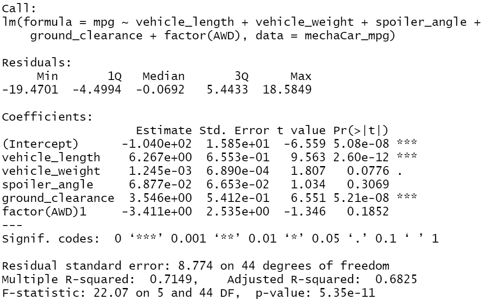

The purpose of this project was to provide a company, MechaCar, with insights on the manufacturing of their cars based on statistical analysis.
## Linear Regression to Predict MPG

By looking at the summary of the linear regression model (seen above), we can come to a few conclusions. We can draw conclusions about the variable that provide a non-random amount of variance to mpg, the slope of the model, and the predictive abaility of the model. 
### Non-Random Variables
The following variables provide a non-random amount of variance to mpg:
* vehicle_length
* ground_clearance
### Slope
Based on the summary above, we can see that the p-value for the model was 5.35e-11. The p-value is much smalled than the assumed significance level of 0.05. Therfore there is enough evidence to reject the null hypothesis and we can conclude that the slope is not zero. 
### Predictive Ability 
With an r-squared value of 0.7149, we can say that the linear model predicts mpg of MechaCar prototypes pretty effectively. This value tells us that roughly 71% of the variablilty of our dependent variable is explained using this linear model. 

## Summary Statistics on Suspension Coils

The above image is a table of the summary statistics for the PSI of all of the suspension coils for the MechaCars. The current manufacturing data meets the design specifications for the lots altogether since the variation does not exceed 100. 

However, when we look at the lots individually (seen above) we can see that all of the lots do not meet this specification. Both Lot 1 and Lot 2 do adhere to the specification, but Lot 3 greatly exceeds it with a variation of 170.29. 

## T-Tests on Suspension Coils
### All Lots 

When looking at the t-test for all of the manufacturing lots, we can see that the p-value is 0.06. Since this value is above our significance level we do not have enough evidence to reject the null hypothesis. Thus, when looking at all of the lots we should conclude that the mean is statistically similar to the population mean of 1,500.

### Lot 1

Now, looking at the t-test for just manufacturing lot 1 we can see that the p-value is 1. Since this value is above the significance level we would also fail to reject the null hypothesis and conclude that the mean is similar to the population mean. 

### Lot 2 

Looking at the t-test for manufacturing lot 2 we can see that there is a p-value of 0.61. Since this value is above the significance level we would also fail to reject the null hypothesis and conclude that the mean is similar to the population mean. 

### Lot 3

Finally, looking at the t-test for manufacturing lot 3 we can see that there is a p-value of 0.04. Since this value is below our significance level we have enough evidence to reject the null hypothesis. Thus, when looking at lot 3 alone, we should conclude that the mean is statistically different from the population mean of 1,500.

[Github Repo](https://github.com/naomishields/MechaCar_Statistical_Analysis)
